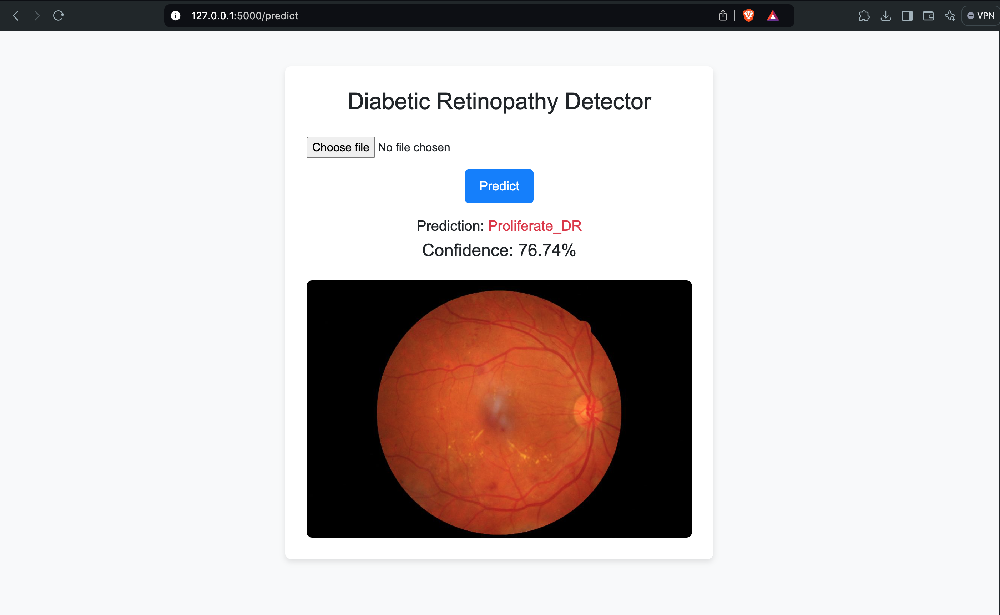
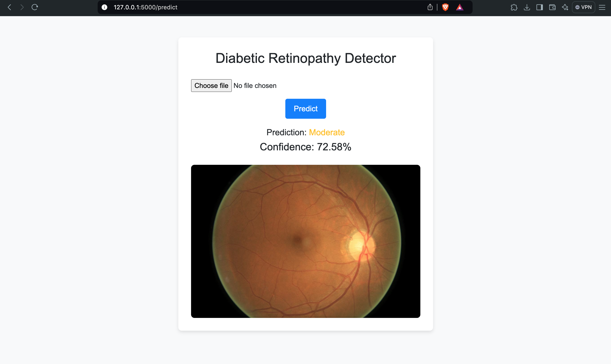

# 🧠 Diabetic Retinopathy Detection

A Flask-based web application for detecting **Diabetic Retinopathy (DR)** from retinal fundus images using a trained deep learning model.

---

## 📌 Features

- ✅ Upload a retinal image
- 🔍 Predict DR stage: `No_DR`, `Mild`, `Moderate`, `Severe`, `Proliferate_DR`
- 📊 Display prediction and confidence score
- ⚙️ Built using Flask, Keras, TensorFlow, and Bootstrap

---

## 🚀 Getting Started

### 1️⃣ Clone the Repository
```bash
git clone https://github.com/Vidish3442/Diabetic-Retinopathy-Detection.git
cd Diabetic-Retinopathy-Detection
```
### 2️⃣ Install Requirements
Set up a virtual environment and install dependencies:
```bash
python -m venv venv
source venv/bin/activate      # On Windows: venv\Scripts\activate
pip install -r requirements.txt
```
### 📦 Model Setup
Due to GitHub's 100 MB file size limit, the trained model is not included in the repository.

🔽 Download Manually

Download the trained model manually from Google Drive:

👉  [Download dr_model.h5](https://drive.google.com/file/d/11DVFnbesDNaxrqCSAwgC8t76Ntgdu2q_/view?usp=sharing)

Then place the downloaded dr_model.h5 file into the root directory of the project:

## 📁 Project Structure

```plaintext
Diabetic-Retinopathy-Detection/
├── app.py               # Main Flask application
├── dr_model.h5          # ✅ Trained model (Place here manually)
├── modelcode.ipynb     # 🧠 Jupyter notebook for training the model
├── requirements.txt     # List of Python dependencies
├── README.md            # Project documentation
├── templates/
│   └── index.html       # HTML template for the web interface
├── uploads/             # Folder to temporarily store uploaded images
├── assets/              # 📷 Screenshots and images for README
│   ├── img1.png
│   └── img2.png

```
## 🖼️ Screenshot

Here’s how it looks:






## License

[MIT](https://choosealicense.com/licenses/mit/)